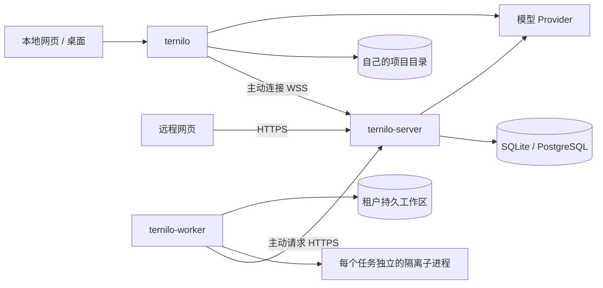

# 架构

Ternilo 将界面、远程入口和任务执行分开部署，并共用同一套 Agent 内核。本文面向维护者；安装程序见[本地快速开始](getting-started.md)，部署远程入口见[服务器部署](deployment.md)。

## 三个程序分别负责什么

| 程序 | 运行位置与职责 | 主要配置与数据 |
|---|---|---|
| `ternilo` | 在自己的电脑、家用服务器或 VPS 上执行任务，提供本地网页；可主动连接 Server | 本机工作区登记、会话、模型、插件、凭据和附件；项目文件仍在所选目录 |
| `ternilo-server` | 提供远程网页、账号、共享权限和机器管理；启用托管执行后管理队列并代理模型请求 | SQLite 或 PostgreSQL、私有 Server 配置、Server 主密钥 |
| `ternilo-worker` | 可选的托管执行进程；主动联系 Server，为每个任务启动隔离子进程 | 独立 Worker 凭据、运行配置、持久工作区文件；不连接数据库，不持有 Server 主密钥或模型 API Key |

桌面应用是连接本地服务的客户端。Node 是 `ternilo` 接入 Server 后承担的连接角色，不是需要另外安装的程序。

Server 中的空间（tenant）组织成员、资源和配额，分为个人空间和团队空间。每个账号在创建时原子获得一个个人空间和默认项目；加入团队不改变个人空间归属。单用户与多用户只决定谁可以使用 Server。两种模式都能管理多台自有电脑和 VPS，都能选择 SQLite 或 PostgreSQL，也都能按部署需要启用托管 Worker。多用户增加账号之间的授权与协作；机器在本地还是云端不决定它属于哪一种模式。Agent Team 在两种模式中均可使用。

`ternilo` 的网页、管理和实时接口强制监听回环地址；它不接受其他机器登记，也不承担中继。远程入口由 Server 提供。Local 和 Server 可以部署在同一台电脑或 VPS；只有本机使用时，不需要 Server。Worker 同样主动连接 Server，无需向 Server 开放自身的任务执行端口；其健康检查接口默认仅监听回环。

数据库地址、监听地址、数据目录属于启动配置；Server 的访问模式、成员、共享、模型和机器登记通过软件管理。切换访问模式不会切换数据库，也不会搬动项目文件。配置入口见[部署说明](deployment.md)与[用户指南](settings.md#设置目标与数据归属)。

## 分层

### 本地应用与入口适配

`crates/ternilo-local/src/application.rs` 保留 `LocalApplication` 的共享状态、启动装配与通知入口。`application/` 下的 `sessions` 负责会话生命周期，`turns` 与既有 `submissions` 分别处理运行输入和持久队列，`runtime` 负责运行时装配／关闭与模型配置合成，`subagents` 管理子会话与 Agent Team；`model_origins` 追溯固定运行的输入作者，`directory_admission` 复用该来源实施目录准入。`providers`、`presets`、`workspaces`、`history` 分别承载模型与凭据、预设与扩展、工作区、历史查询与反馈；它们是同一应用的内部实现，不是新的服务或数据副本。

`apps/ternilo/src/node.rs` 保留远程连接和握手，`node/events.rs` 负责事件追赶与实时通知，`node/replies.rs` 保留命令去重与回复持久化，`node/application.rs` 负责受信任命令派发和输入来源核验。`apps/ternilo/src/web.rs` 保留 HTTP 启停、鉴权和路由装配，`web/` 下按会话、工作区、Provider／授权、预设／扩展及静态资源组织处理器。网页与 Node 始终调用同一个 `LocalApplication`，不各自实现队列或权限逻辑。

`apps/ternilo-server/src/platform/mod.rs` 负责启动与路由装配；`spaces`、`computers`、`tenant_services`、`extensions`、`execution` 和 `capabilities` 分别处理空间、电脑、租户服务、扩展、执行及能力查询。`edge/` 管理 Node 连接、命令与事件复制，`workbench/` 按执行位置适配统一工作台操作，两端 `live/` 负责连接、订阅与增量输出。内部拆分不增加持久状态副本，也不改变事务、权限检查或确认时机。

### 产品协议

`ternilo-protocol` 定义与 Web 框架和运行时无关的 DTO：

- `TenantId`、`UserId`、`AgentId`、`SessionId`、`RunId`；
- `RunSpec`、Profile、运行限额和权限预设；
- 模型消息、附件、工具结构、调用与结果；
- Provider、模型、凭据、授权流程和 Agent 预设；
- Agent Team 成员、任务、消息标识，任务版本与邮箱请求；
- 只追加的 `SessionEvent`，问题、计划、目标、调度与 `RunOutcome`。

`ternilo-transport` 定义版本化执行消息与 Node 的 WebSocket 通道：

- 执行器种类、能力集合、握手与心跳；
- 租户／用户作用域、命令 ID、签发和过期时间；
- 应用 RPC、执行配置、取消、回复和连续事件批次。

Transport 不依赖 Linorun 或本地状态。Node 接收经过认证的本地应用操作；Worker 通过 `ternilo-cloud` 的版本化 HTTP 协议取得 Server 编译和授权的 `RunSpec`。两种执行位置复用身份和执行数据类型，但接入协议和可执行操作各自明确，不能互换。

### 内核与 Linorun

Linorun 是独立通用库，负责组件生命周期、服务路由、依赖激活和组件退出时的清理，不了解 Agent、用户或租户。`ternilo-kernel` 在其上提供最小的 Agent 启动能力：

- 可信插件目录将 `kind + JSON config` 构造成 Linorun 组件；
- Profile 分层合并、服务依赖校验和激活；
- 启动或关闭会话运行时；
- 统一 `HarnessSession::run/events/shutdown` API；
- 注入不能被 Profile 放宽的宿主环境和策略。

Kernel 不实现具体模型、提示词、工具、存储或 Agent 循环。

MCP/LSP 通过 `DeferredToolSource` 登记延迟启动的工具来源。状态查询使用 `service_catalog`，不会发现工具或启动进程；显式工具发现使用可失败、可取消的 `discover_tools`，`tool_catalog` 同样返回 `Result`。工具注册表在运行准备阶段发布完整 schema，并在卸载时先取消外部服务再撤销贡献。Local 的目录使用权覆盖任务及其受控后台进程，服务在成功调用后继续持有，直到实际进程收尾。

### 插件图

| Contract/贡献 | 内置实现 | 可替换方向 |
|---|---|---|
| Sessions | Append-only event log | PostgreSQL/object-store-backed provider |
| Prompts | Effect-owned ordered registry | Operator/tenant/user layers |
| Skills | Ranked provider registry + on-demand definition load | Workspace、Extension 或远程 provider |
| Tools | Schema、effect、handler、monotonic guard | Rust、WASM、MCP、远程 capability |
| CodeRuntime | Rhai + `native/code/both` projection | Python、TypeScript、容器或远程 runtime |
| Models | Rule、OpenAI／DeepSeek／Gemini／Claude 远程协议、host gateway | 额外协议或独立生命周期的模型实现 |
| AuthorizationFlow | API-key flow 与 scoped writer | OAuth、device code、managed identity |
| Agents | ReAct loop | Planner、research 或领域 loop |
| Processes | Files/shell/job/terminal + trusted sandbox seam | Container/microVM capability |
| Integrations | MCP、LSP、HTTP、SearXNG、Hooks | Managed sidecar/provider |
| Extensions | 统一签名 Extension Registry；每包单选 Rhai 或 WASM Component；已支持 Tool、静态 Prompt/Skill、Hook、Command 与 Provider template | 新 capability host API / WIT world |
| Collaboration | Skills、Plan、Workflow、subagent、Agent Team、schedule | Distributed provider |

Profile 是有序 row。多层 profile 按稳定 ID 定位，后层替换整行；依赖服务可用性决定激活顺序，而不是配置文件顺序。插件贡献必须由 activation effect 拥有，撤销后不残留 prompt section、Skill provider、Hook、Tool、Command 或 service；Provider template 创建的普通 Provider 是独立用户数据，不随扩展卸载删除。

“Everything is a plugin”只描述产品行为。Authentication、tenant isolation、quota ceiling、catalog trust、credential 和 OS sandbox 的最终授权由宿主控制。每个工具声明 `ReadOnly`、`Mutating` 或 `Dangerous`，宿主在 handler 前统一检查；Plan、permission preset、Code Mode、MCP 和 Rhai/WASM Extension 因而共用同一上限。

### 模型插件与协议边界

远程模型使用同一个模型插件，在每个 Provider 中选择协议。Provider 保存地址、凭据、模型目录和默认设置；协议适配器负责请求格式、工具表示、历史回传、流式事件和用量解析。多个 Provider 可以同时存在，不需要按服务商安装或启用不同插件。

实现位于 `crates/ternilo-builtins/src/model/`：`mod.rs` 负责插件组装，`transport.rs` 负责 HTTP、SSE 分帧、重试和取消，`protocols/` 下的 `openai_chat.rs`、`openai_responses.rs`、`deepseek_responses.rs`、`gemini.rs`、`anthropic.rs` 是平级模块。`responses_wire.rs` 仅复用共同的 Responses 消息、工具和用量格式，OpenAI 的推理摘要与 DeepSeek 的完整思考正文由各自适配器处理。离线规则模型保留独立实现 `model_rule.rs`。

Gemini 与 Claude 使用原生认证、发现、工具、历史和流解析。思考签名及不透明块随 `ModelProviderState` 持久化，按原协议及实际模型回放，不从可见思考文本重建签名。原生能力与限制见[模型说明](models.md)。需要独立运行环境或不同服务生命周期的模型实现，才另设插件。现有远程插件标识仍为 `ternilo.model.openai_compatible`，它是配置标识，不限制代码目录或协议模块的扩展方式。

### 本地应用层

`LocalApplication` 管理本地产品状态，供网页、桌面、Node 连接与自动化入口共同调用：

- 工作区和会话生命周期；
- Provider/model 库与独立 credential store；
- 内容寻址 attachment 和交付物；
- 问题/审批/authorization interaction broker；
- 会话启动、事件归档、界面状态投影与定时调度；
- 创建子代理时同时登记可持久保存的子会话：内置子代理保存正常会话记录，外部 ACP 子代理保存生命周期记录；`parent_session_id` 支持多层子代理，导航使用事件中明确保存的会话绑定；
- `agent-team.sqlite3` 保存共享任务和成员邮箱；成员列表来自已保存的主会话与子会话关系，普通会话分叉建立独立 Team。

以下入口复用同一应用契约，但其生命周期不同：

- `apps/ternilo` 的 `serve` 创建唯一持久本地服务，同时提供 loopback HTTP 与可选的出站 Server connector；Node 是该连接角色，不再是独立 binary。
- `apps/ternilo-desktop` 是 Tauri 客户端；优先发现并认证同数据目录的已有服务，否则从自身可执行文件启动独立后台服务。
- `run` 为单次任务创建内存 Harness；`rpc` 与 `acp` 仍各自创建持久 `LocalApplication`，必须使用未被本地服务占用的数据目录。

本地网页、桌面客户端和远程网页可以同时连接一个本地服务，共用 writer gate、session runtime、scheduler 和事件日志。桌面关闭不会停止服务。另一个 `serve` 不能再打开同一目录；服务配置改变需要显式重启。

本地服务将实例身份、版本、PID、实际地址、网页/远程状态及随机 token 写入数据目录的私有 `service.json`。发现时先限制 loopback，再通过认证 API 核对实例身份；桌面额外校验版本与网页是否启用。`ternilo status/stop --data-dir` 复用同一发现和认证流程。`--no-local-web` 只关闭网页表面，仍保留认证后的 API 和管理入口。

### 界面与接入层

`web/` 是本地服务、Server 和桌面 WebView 共用的 bundle。环境差异由动态 boot 信息决定：本地注入随机 API token，Server 使用原生账号及可选 OIDC，桌面附加目录选择、通知和 deep link IPC。

HTTP 与 WebSocket 入口使用 Salvo。Salvo request/response/router/WebSocket 类型只存在于 app adapter；`LocalApplication`、kernel 和 executor protocol 不依赖 Web 框架。桌面端继续使用 loopback HTTP，不在 Tauri command 中重写 application API。

页面先读取工作台快照，再按事件游标读取新增记录。浏览器状态只用于显示，已保存的会话日志才是事实来源。回答使用随程序打包的 Markdown、代码和 MathML 渲染器，并限制允许的 DOM 元素。PWA 只缓存公开界面，不缓存 API、登录凭据或会话记录。

## 会话与数据流

### 事件事实源

模型历史由只追加的会话事件生成，不另存一份隐藏的对话状态。插件投影声明稳定标识、版本、初始状态及状态合并规则；本地 SQLite 检查点只加速读取。版本变化、校验失败、日志截断或生命周期不匹配时，从已保存的 JSONL 日志重建。

事件先保存再广播。Node、网页、自动化和调度器错过实时通知后，都可以按游标补读。每个会话只允许一个有效写入者；托管执行还使用递增写入代号（fencing token），使旧进程即使恢复连接也不能继续写入。

Node 向 Server 推送历史事件时，每批都等待持久化确认才推进发送游标。Server 在合并事务提交后返回实际游标，未登记会话不缓存正文，也不确认持久化序号；后续登记时 Node 仍保留完整前缀。确认丢失后，重连按 Server 已提交游标补发，重复事件必须与原记录一致，不允许跳过缺失历史或改写已存在事件。

### 浏览器实时协议

`/api/v1/live` 在一条 WebSocket 上承载工作台状态和当前会话订阅，协议类型定义在 `ternilo-protocol::live`。凭据通过首个 `hello` 帧传递，不放进 URL 或 WebSocket 子协议；收到匹配版本的 `ready` 后才能订阅。

| 帧或字段 | 维护时必须保留的含义 |
|---|---|
| `workbench` / `activity` | 工作台快照与会话活动增量，不包含所有子会话的完整历史 |
| `subscribe.after_seq` | 客户端已接受的最后一个事件序号；服务端从下一条开始读取 |
| `subscription_id` | 每次订阅使用新的递增标识；切换会话后丢弃旧订阅的事件、元数据与局部错误 |
| `event_batch.next_seq` | 第一条尚未交付的事件序号，与 `after_seq` 的含义不同 |
| `event_batch.reset` / `complete` | 分别表示替换原历史基线、当前补读批次已结束；大历史可以拆成多帧 |
| `session_metadata.read` | 明确这一帧读取了哪些状态，不能把“没有读取”误解为“读取结果为空” |
| `error.subscription_id` | 有值时只影响对应订阅；无值时表示连接级错误 |

数据库通知只负责唤醒读取，不能代替会话日志。Cloud 事件和工作台变更已支持 SQLite 持久变更补读，以及 PostgreSQL 的 LISTEN 通知与持久补读结合。PostgreSQL 的序号分配顺序可能与提交顺序不同，低于扫描游标的迟提交通知也必须触发重新读取；监听重连后还要重新检查状态。Node 网关的连接与实时广播仍由当前 Server 进程持有，不能由已有数据库通知推断为支持跨 Server 的 Node 命令路由。

直接共享、项目规则、工作区继承、权限组及空间成员变更通过 `resource_live` 组件在同一事务中记录空间失效提示。连接同一数据库的其他 Server 收到提示后，重新检查身份、当前订阅和资源权限，再读取工作台；回滚不产生通知。通知不携带会话正文或成员权限明细，也不为浏览器增加定时全量刷新。

正常空闲工作台不为每个会话反复轮询事件。用户操作后的定向读取、主动搜索以及打开管理面板后的状态刷新仍是正常请求。排查实时更新时，应先区分 WebSocket 连接失败、订阅读取失败和目标执行机器离线，不用定时全量刷新掩盖丢通知或游标问题。

### 队列与注入

每次提交都有独立的 `submission_id` 与接受时的运行来源，相同文本不会去重。本机队列由 `LocalApplication` 保存，托管队列由 Server 数据库保存；浏览器不另外维护一份权威队列。普通排队消息在前轮结束后可以合批，写成同一执行轮中的多条独立用户消息，保留各自作者、附件和输入 ID，不拼成一个用户气泡；不兼容的模型／权限／预算等配置是批次边界。

只有尚未执行的排队项可以编辑或删除。网页“停止并发送全部”先持久暂停队列并取消当前轮，等旧轮退出后再恢复、提交新批次；不是将消息暗中插入旧模型步骤。普通停止保持队列暂停，恢复提交唤醒原有队首，不让新消息插队。托管任务的编辑、配额调整、当前项结束和下一项提升在相应数据库事务内完成。

内部步骤边界 steering 仍要求当前执行进程确认，不能把命令已入库当作已消费。带对应 `submission_id` 的用户消息事件是已消费的依据；窗口关闭、执行进程退出或租约失效时，尚未消费的项按原身份回到队列，恢复不会复制一份任务。该内部能力不等同于网页“停止并发送”。

排队项编辑使用开始编辑时的版本；Local 在会话锁与 SQLite 事务内校验，Cloud 在最终队列行锁与事务内校验。编辑、领取、重排和恢复均严格推进版本，冲突不改变内容或执行来源。接口与客户端草稿规则见[工作台 API](server-reference.md#统一工作台)。

持续目标的状态与运行激活分开：设置或恢复经过原命令权限链，在同一已授权 Run 中续轮，不伪造用户输入，也不根据最新发言更换作者。读取、编辑、完成和阻塞只管理状态；重启或分叉不自动恢复运行。用户操作及限额见[计划、待办与目标](agents.md#plantodo-与-goal)。

### 模型流与取消

远程模型的各协议适配器解析对应 SSE delta，并等待下游接收后再继续读取网络。Agent loop 写有序 `assistant_message_delta`，完成时写唯一 `assistant_message`。Bounded channel、event commit 和浏览器 cursor 共同形成背压。

取消由 run-scoped cooperative signal 驱动：模型读取、可取消的工具 future 和等待用户回答响应取消，最终写入 `turn_cancelled`。WASM 工具为每次调用建立取消监视并触发 epoch，Store 按自身的取消上下文决定是否中断，其他并发调用继续运行；退出时回收监视线程，fuel／内存上限独立保留。该机制不强行中断宿主同步文件系统调用，也不把取消外层等待等同于所有资源已经退出。取消不是普通副作用事务回滚；工具已经完成的外部动作仍以事件和工作区状态为准。

### 模型连接与凭据

设备本地模型选择使用 Provider ID 和 Model ID，账号／平台来源还保存明确的持有人、授权绑定与能力快照；同名模型不是同一来源。服务地址、模型容量、推理设置、重试规则和凭据引用保存在对应来源的配置库，凭据值单独保存。模型的上游声明与手动覆盖分开保存，执行前逐项按手动值、上游明确值、Provider 默认值解析上下文窗口、最大输出和推理值；明确禁用推理与未提供配置不混为一谈。旧整组配置保持原含义，编辑器保存为等价的逐项设置。模型发现及请求都由可信服务发起，保存后的 API Key 不回显到浏览器。

上下文窗口同时供 Web 占用环和自动 compaction 使用。自动阈值按解析后窗口的百分比计算；未知窗口时不退回固定 token 猜测。Local、Node、Server 和 Worker 共用同一解析规则，避免界面能力、Cloud broker admission 与实际请求分叉。

自己的电脑或 VPS 由 `ternilo` 管理模型并调用 Provider，Server 不复制它的模型库。包含秘密的凭据和授权操作只在线传递，不写入可重放的命令日志。托管工作区支持部署者提供的模型，以及用户自备的 Provider/API Key；用户配置按租户和资源所有者隔离。托管模型请求由 Server 解析和调用，Worker 父进程只转发请求与流式结果，父进程和隔离子进程都不取得模型 API Key。

Server 另提供无需 Worker 的独立模型服务。平台管理 API 保存加密上游和公共模型，平台模型组直接关联账号；用户的模型 Key 只保存摘要，固定 grant 和模型子集。模型目录返回当前有效交集，生成端点分别转发原生 Chat Completions／Responses、Gemini generateContent／streamGenerateContent 和 Claude Messages JSON 与 SSE，不提供跨协议翻译。公共模型 ID 替代内部模型名，普通用户用量投影不含内部上游标识或原始诊断字段。

独立模型请求在同一数据库事务中验证授权并预留 grant／Key 额度与并发；该调用不要求 Session、Run 或 Worker lease。Node 与托管任务已复用模型网关、请求／尝试账本及逐次重试授权，另外核验各自的固定运行来源或执行租约。真实操作者、资源所有者、模型受益人和执行空间预算分别保存，不把所有消耗归给资源 owner。取消和撤权后仍可结算已接受调用，未知用量保留预留，过期清理释放并发。每次公开模型 API 请求只有一个上游尝试，同 Key 的相同幂等请求不重复调用。

### 大输出与附件

输入附件、过大工具/Code Mode 输出和文件交付物共享 `Attachments` service，但事件语义不同。Local provider 使用 SHA-256 私有对象并在读取时验 digest。大结果在 session append seam 变成有界 preview + locator；文件写入立即保存当时版本的 deliverable snapshot。

### Agent Team

一个普通会话建立一个 Agent Team。只有带已保存 `subagent` 元数据的子会话及其后代才加入该 Team；普通历史分叉即使保留父会话关系，也建立新的 Team。对外使用不包含宿主路径的成员、任务和消息 ID；子会话导航使用已保存的绑定，不能从 Team ID 猜测。

本机成员列表来自本地会话树，任务和邮箱保存在独立 SQLite 中；托管成员列表、任务和邮箱由 Server 的共享数据库保存。两种位置的任务均采用完整替换，并用 `expected_revision` 检查是否被其他操作修改，支持负责人、依赖与 `pending/in_progress/blocked/completed/cancelled` 状态。邮箱只返回当前成员发送或接收的消息，发送者由服务端确定。邮件不会自动启动模型；立即续发和停止继续使用子代理操作。

Kernel 只定义 `AgentTeam` 宿主服务。`LocalApplication` 注入本机实现；Worker 父进程注入通过 Server 协议访问任务和邮箱的实现。7 个内置工具与网页操作共用同一组数据和权限，界面只做轻量同步，不另建一套协作状态。

## Workspace placement 与远程路径

平台的 Workspace 是文件、会话与执行位置的绑定：

- `local_node`：Harness 与实际路径留在用户电脑。用户在 Server 创建短期、一次性 enrollment，Node 换取无时间到期且可显式吊销的 credential 后主动连接 `/api/v1/executors/connect`；浏览器始终只连接 Server。已登记 executor 不提供 credential 刷新或轮换，必须先吊销再重新登记。
- `cloud`：Harness 在隔离 Worker child 中运行，文件位于 tenant Workspace 持久卷。

Server 的 placement resolver 让两类 Workspace 共享列表、Session、Chat、Trajectory 和设置 API。Session 创建后绑定一个 placement；Ternilo 不在没有显式文件和状态复制的情况下把会话静默迁移到另一位置。

Node 通道使用有期限 typed command。Server 按已认证账号、membership、逐资源权限和持久的 opaque executor binding 路由，不接受浏览器自报的 Node Session ID 或宿主路径。Node 再次校验 scope/expiry，在共享 `LocalApplication` 执行，并推送连续 event batch；断线期间已经开始的任务可以继续在本机运行，重连后按 cursor 补读。

Agent Team 的本机操作通过 Node 通道访问本地任务和邮箱，远程网页因此能看到同一 Team。托管子进程先通过父子进程管道发出请求，再由 Worker 父进程调用 Server；网页直接调用 Server。两条路径最终访问同一份持久数据。

## Server 身份、资源与存储

`ternilo-server init` 创建私有配置与数据库，`ternilo-server serve` 启动唯一 Web/API 和 Node Gateway。单用户／多用户是实例中持久化的访问模式，与 SQLite／PostgreSQL 的部署选择独立；切换模式不会建立另一套账号或资源。单用户模式暂停其他账号的远程访问，保留其数据和资源归属。TLS 由外部反向代理终止。

原生账号使用密码哈希与可撤销的浏览器会话。OIDC 可选；已经登录的原生账号可以显式绑定 OIDC 身份，保留同一 user_id、工作区、凭据和配额归属。绑定不会按邮箱合并账号，也不会把已经属于另一账号的身份转移过来。

Workspace 与 Session 由当前管理者向团队成员或权限组显式授予 View、Submit、Stop 和 Configure。Session 可以继承 Workspace 授权，也可单独分享；单独分享不会暴露整个父工作区。各来源的权限取合集，再受团队角色上限限制。实例管理员的管理身份不自动授予资源访问。同团队的[资源管理权交接](resource-management.md)独立保存管理者与版本，不改写原存储／执行身份、Node 绑定和历史作者。输入和审计记录实际操作人；模型费用使用明确选中的来源／受益人，执行空间预算另行核验，不能简化为全部按管理者计费。

团队组和组员由 Control 管理；组员必须属于同一团队，数据库外键在成员或组删除时清理关联授权。用户主动 fork 只保留发起者的权限，后台子代理不自动扩散授权。组来源保存原始共享引用与分叉时的权限上限，实际权限取原授权当前值与该上限的交集；再次分叉使用同一原始来源。所有者显式保存子会话用户授权时，移除该用户的派生来源并写入独立授权。单独用户授权保留原有复制行为。

成员、组、组员、授权列表和共享候选统一使用有界游标分页。Server 的 `/api/v1/tenants/{tenant_id}/groups` 管理团队组，工作区／会话的 `sharing/candidates` 提供可授权对象，`sharing/{user|group}/{id}` 修改具体授权；资源所有者之外只返回本人的有效权限及来源。

Provider、机器凭据、插件安装和默认配置仍由原执行账号或电脑所有者管理；资源管理权交接不授予这些权限。共享成员可读取脱敏的模型／预设目录与凭据就绪状态；Configure 只修改当前会话配置。计划及工具审批按持久的真实问题分类检查权限。共享附件要求目标会话已有真实引用，不能凭其他会话的摘要读取或自授权。撤销 View 后，HTTP 与 Live 都停止向该成员提供会话数据；Live 在授权通知、丢失通知后的重新读取和周期检查时复核当前订阅，也在发送内容前检查。访问撤销不自动取消已经接受的任务。

### 共享数据库

`ternilo-storage::Database` 是 Control、Cloud 与 Gateway 的同一连接池和事务入口。SQLite／PostgreSQL 使用同一套 Rust 业务规则：账号、资源归属、配额、审计、命令日志、运行队列、租约、fencing、事件和恢复不会各维护一套实现。跨资源、配额和入队操作在同一个事务中提交或回滚；JSON 统一保存为文本。

SQLite 使用 WAL、外键和 `BEGIN IMMEDIATE` 串行短写事务；PostgreSQL 使用行锁、事务级 tenant／user scope 和 RLS。跨 owner 的 Worker 候选发现只保留受限的只读查询入口，业务状态转移在 Rust 中完成。初始化直接安装最终 schema；每个组件声明自己的 schema 版本；已初始化组件采用只读版本检查，无 DDL 权限的 runtime 账号也可正常启动。版本不匹配时明确拒绝启动，不执行替换 SQL。

### Node 路由与事件

Node 所有者将本地服务登记到 Server 后，工作区与已有会话自动建立持久映射。浏览器使用公共 Session ID，Server 授权后才取得 executor 与 Node-local Session ID；客户端提交的 executor、Node Session ID 或宿主路径不是路由依据。未知、尚未完成登记的会话事件不会进入其他映射的缓存。

Workspace 从侧边栏移除是逻辑 unregister，不删除执行绑定。已有 Session 进入未分组状态，仍可继续运行、归档或派生。Node 离线时保留资源元数据和已持久事件；需要 Node 的操作明确返回不可用。搜索只合并当前账号可见的资源，单个离线节点不阻塞其他分片。

本地删除通过持久增量记录同步；Server 在同一事务写入删除标记，清理事件、附件元信息、公开会话映射及用户／组共享关系，保留运行来源和模型计量。资源发现与删除处理使用同一电脑作用域的锁，拒绝用旧快照或迟到事件重建已删除身份。不从电脑离线或快照缺项推断删除，也不影响另一台电脑上的同名本地会话。重复删除已不存在的会话可以成功，但对现存资源仍检查删除权限，绑定目录中的文件不随会话删除。

Gateway 将连接 lease、fence 校验与命令／事件持久化放在同一个 Database 事务。秘密和交互式授权只在线传递，不写入可重放命令日志。Node 连接、待处理调用和实时广播仍位于当前 Server 的内存；入口请求先查本实例的连接，尚无跨实例转发到实际连接持有者的完整链路。Live 按已提交游标读取 Node 历史；Cloud 的数据库通知与补读另由共享 feed 提供，不因每个文本分片刷新整份工作台。

### 本机目录协调

本机与 Node 的目录准入按可信输入作者区分：同一用户的普通会话、分叉和 CLI 可以并行使用相同或重叠目录，不同用户仍按真实目录占用互斥。后台资源独立保留使用权，直到最后一个实际持有者退出；子任务和定时任务回溯原始运行作者，不能借后来的发言者改变归属。Node 只从经过认证的 Server 欢迎信息确认电脑登记所有者，允许该所有者与本地操作共用目录；保留原账号 ID，不把不同 Node 所有者合并为一个本地身份。并行不会授予新权限，也不会自动合并同一文件的竞争修改。

输入先持久化，再申请目录使用权，取得后才解析文件引用和调用模型／工具。无法确定作者的内部操作继续使用持久执行范围。使用权位于操作系统用户状态目录下的 `ternilo/execution-locks`，独立于应用数据目录，使同一系统用户启动的服务与 CLI 可以跨进程协调；Unix 使用设备和 inode 识别目录，各持有者保留实际文件锁。取消一个会话不释放其他持有者，模型回答结束也不代表后台任务、终端、MCP 或 LSP 已退出。

协调不覆盖其他操作系统账号、跨主机共享盘、外部编辑器、脱离受控范围的程序或完整访问模式下声明目录外的写入。不同用户或未知归属的内部操作阻挡时仍需等待，可保留草稿或停止；等待不调用模型，不按超时强行接管。

### Worker 执行与恢复

Worker 只持有自己的可撤销凭据，通过 `/internal/worker/v1` 主动请求配置、登记、心跳、任务和会话操作；模型流使用该协议下的模型接口。凭据与存储绑定、连接代次、任务租约和写入代号均由 Server 检查，不能仅凭客户端提交的用户或任务 ID 取得权限。

托管任务按以下路径执行：

1. Server 验证资源权限、有效 Profile、插件目录和配额，保存任务后进入队列。
2. Worker 领取适合其存储位置的任务并定期续租。Server 为会话分配写入代号，拒绝过期或被替换的进程写入。
3. Worker 根据 Server 下发的 `WorkerPolicy` 再次检查插件、扩展、模型与限额，为任务启动独立子进程。正式隔离模式关闭子进程网络，将程序文件设为只读，只开放获准的工作区。
4. 子进程的模型请求先交给父进程，再转发给 Server。Server 在调用 Provider 前检查预算，收到 Provider 用量后先幂等入账，再向 Worker 返回完成结果。Worker 不取得模型 Key。
5. 事件、问题、回答、取消、子代理任务及遥测确认都通过 Server 协议持久化；数据库状态变更只有一套 Rust 实现。
6. 成功、失败、取消或租约回收都会结算已记录用量。已领取但尚未启动的任务可以按重试预算重新安排；执行中失去有效租约的任务进入 `indeterminate`，提示检查结果，不自动重做可能已修改文件的操作。

执行准入与模型预算分别管理。预算在提交时预留；Cloud 在领取和恢复时原子检查空间与 Worker 的前台名额，同时限制 Worker 驻留名额。Kernel 的活动分支贯穿原生工具、Code Mode 阻塞线程和 Workflow；只有全部真实前台分支都在等待已接纳的运行依赖时才允许让位。恢复必须取得新的执行准入，脚本异常处理不能绕过这个步骤。父进程等待期间仍占驻留名额和原预算，后台子任务单独计算。

等待与恢复事件由执行端通过原会话事件流提交，保持统一序号。Local 在事件成功落盘后更新内存活动投影，Cloud 在追加事件的同一事务中更新会话投影；Live 直接读取小型投影，不为每个状态刷新重读会话历史。终态只清除对应运行，旧运行事件不覆盖当前运行状态。

每个租户的托管工作区固定到一个持久存储位置。Worker 首次登记时把存储标识绑定到真实磁盘标记；使用同一凭据换成空目录或错误卷会被拒绝。多台 Worker 只有在挂载同一真实持久卷时才能共享该存储标识。断线不会自动把会话迁到另一台机器的空盘；恢复必须带回原文件及存储标记。

托管执行继续使用持久执行范围协调共同目录：普通会话和它正式创建的子 Agent 使用同一范围，普通历史分叉拥有独立范围。范围在会话创建事务中登记，跨轮保持，删除可见历史不会清除登记；已用过的会话 ID 不能再次创建。它不授予查看或提交权限：人工对子会话续发仍按当前用户和目标会话授权检查。数据库中这份关系按空间和资源所有者隔离，Worker 取得的目录票据来自 Server，不能由网页指定。本机准入调整不放宽 Worker 的占用代次和退出证明。

Cloud 的会话模块按职责组织：`store/sessions.rs` 管理会话生命周期，`store/sessions/fork.rs` 负责历史分叉，`store/sessions/records.rs` 负责记录解析；`execution_families.rs` 保存不可变的协作关系，`workspace_occupancy.rs` 记录目录占用，`execution_admission.rs` 管理执行容量，`execution_admission/pressure.rs` 判断驻留容量是否形成真实阻塞。判断范围是持有目录的 Worker，候选必须属于其持有的同一执行范围；其他 Worker 的状态不决定这组任务能否推进。

Start 和过期领取回收共用存储协调锁。未提交 Start 的失效领取会在同一事务释放执行名额与目录登记；Start 已提交的执行保留驻留和物理占用，直到原代次确认退出。目录使用权与模型预算、资源授权分别校验。恢复核验要求同一 Linux 启动环境和 PID 视图；跨宿主、宿主重启或更换容器 PID namespace 的旧占用仍保持未确认，数据库租约到期本身不证明旧进程已停止写文件。

目录代次由独立持久记录递增，尚未退出的同组成员共用一个代次。Worker 保留磁盘上的代次及已结束成员，拒绝旧票据重放；Server 启动事务也核对票据与运行、目录和存储身份。Bubblewrap／Container 的正常退出由 namespace init 的 pidfd 确认，单独的文件锁不再承担退出证明。启动时先保存内核身份，子进程再读取私有管道上的明确授权，之后才加载配置和插件。`isolation.rs` 负责隔离命令与注册前自检，`sandbox_lifetime.rs` 负责启动屏障与内核退出观察；终态提交和物理退出使用独立标记。

文件浏览、下载与交付物读取由 Server 通过持久命令交给相应 Worker，Worker 主动领取并回传结果。Server 不要求与 Worker 共用本机路径，也不把自己的目录当作远端文件。租户空间限额在固定存储位置统一检查；不能把分散在多块独立磁盘上的采样用量误当作同一个硬限额。

资源权限、独立凭据、进程隔离、执行配置摘要和递增写入代号共同保护执行边界。不可信 Rust 动态库不进入 Worker；租户扩展使用签名包，每个包版本只能选择受限 Rhai 或无 WASI 的 WASM Component。具体配置、健康检查和维护操作见[托管执行说明](server-reference.md)。

## Profile 与宿主 policy

云端或本地可按以下优先级组合：

1. Operator base profile
2. Tenant allowlisted profile
3. User Agent preset snapshot
4. Session/run overlay

这些层只选择可信目录中的插件。宿主在 Profile 外实施最终上限：超限时拒绝，不静默放宽；被宿主禁止的工具不能由后层重新允许；Plan 和权限预设继续检查每个工具的副作用。

更改会话 Profile 时，宿主先构造完整候选并校验插件工厂及依赖，再在会话生命周期锁下保存并退出旧运行时。任何字段无效都不会部分更新。

## 仓库边界

后续 Work 将表示用户的托管电脑：一个 Work 绑定一个执行节点上的持久 Docker 容器，容器内使用多个工作区和 Harness。节点宿主管理容器，Work 内不运行 Docker daemon、不挂载宿主 socket。Work ID 与 container ID 分离；默认每用户一个 Work，停止状态仍占名额。当前只保留既有 executor／工作区路由及授权接口，不新增运行模块、数据库资源或管理界面。现有按任务隔离的 `ternilo-worker` 与此模型不是同一实现。

共享内核放在 `crates/`，命令与部署入口放在 `apps/`：

- `ternilo-protocol`、`kernel`、`builtins`：产品契约与插件图；
- `ternilo-local`、`authorization`：本机 application 与 credential interaction；
- `ternilo-transport`、`transport-store`：typed executor transport 与本地去重；
- `ternilo-storage`、`control`、`cloud`：共享双数据库、身份、资源权限、queue、broker 和结算；
- `ternilo-extension`、`ternilo-rhai`、`code-runtime`：统一扩展包、共享受限 Rhai 基线与一次性代码运行时；
- `ternilo-automation`、`acp`：程序化 adapter；
- `apps/ternilo`：本地服务、Node 连接角色、CLI、RPC/ACP；
- `apps/ternilo-server`：`init`、`serve`、`admin`，统一初始化、Web/API、账号、Node Gateway 与运维；
- `apps/ternilo-worker`：独立云端执行父进程与 child；
- `apps/ternilo-desktop`：桌面客户端及内部后台服务启动入口。

只有当团队、发布节奏或法规隔离需要独立生命周期时才适合拆仓。拆分边界应是版本化 transport、HTTP API 和 event schema，而不是重新实现 local core 或 cloud core。
